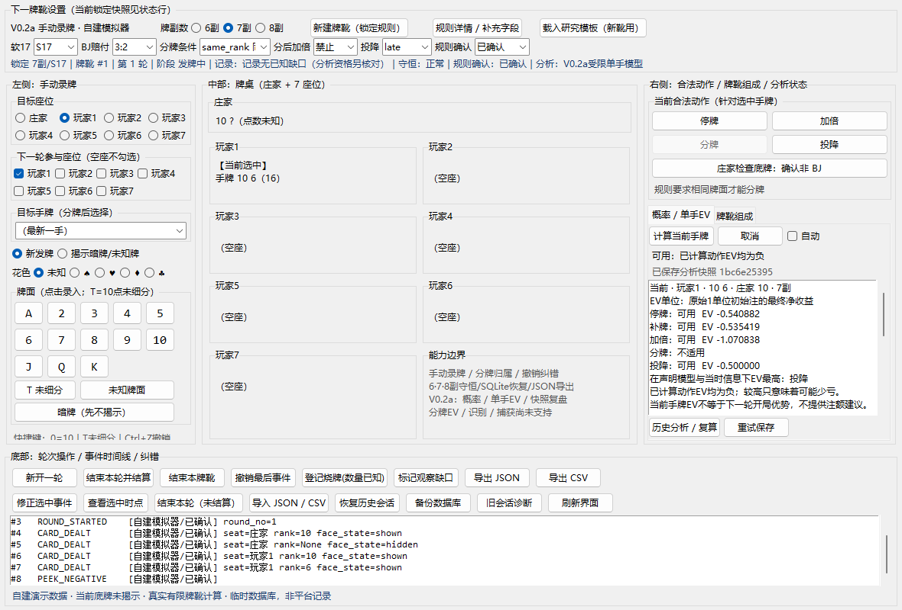
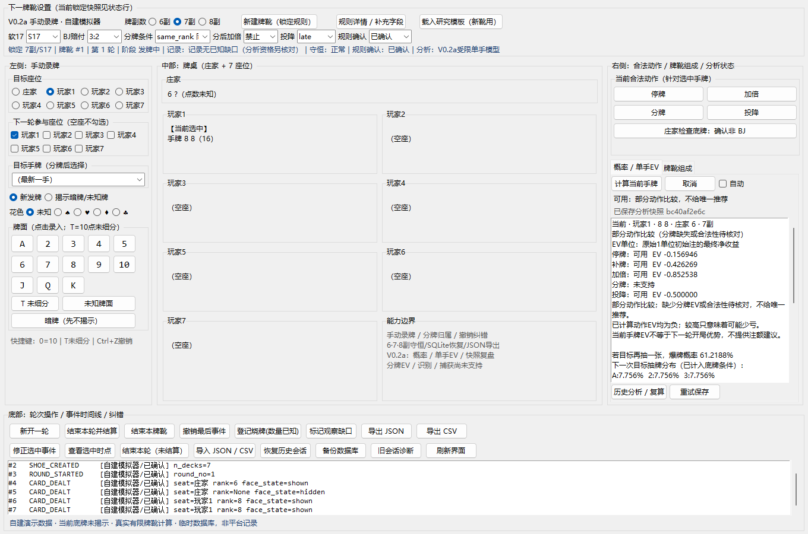

# V0.2a 手动概率与 EV 分析交付报告

2026-09-10。软件版本 `0.2.0a1`。

现在可以在庄家底牌尚未揭示时，录入当前手牌，计算下一张牌的条件分布、补一张爆牌概率、庄家终局分布和当前合法停牌／补牌／加倍／晚投降的 EV。结果在中文界面实际显示并保存为独立快照；重启后可读取原判断，按原事件前缀复算会生成新快照。

运行方式：双击项目根目录 `启动界面.bat`。第一次可导入 `fixtures/v02a/demo-7decks-16-vs-T.json`，再点“计算当前手牌”。该例为自建合成记录，庄家暗牌仍未揭示。完整操作、规则、备份与恢复说明见 [README](../README.md)。运行需要 Python 和 Tkinter，核心功能没有第三方依赖；完整截图验收另用 `requirements-qa.txt` 中的 Pillow。

## 本次实际能力

- 6／7／8 副均进入有限不放回计算。研究模板为完整新靴、明确零初始烧牌、S17、3:2、美式底牌；A／十点明牌在玩家决策前有明确非 BJ 检查。模板不是某个平台已经确认的桌规。
- 未知底牌作为隐藏变量，非 BJ 检查同时改变底牌和下一次目标抽牌的条件分布。补牌之后根据新见牌继续比较补／停，按共同可见信息求值，不按暗牌分别最优化。
- EV 为原始一单位初始注的最终净收益。每个支持动作保存同口径收益分布。合法分牌尚无 EV 时明确显示“部分动作比较”，不会把其余动作中的最高值称为全局最优。全负 EV 明示，不据此推断下一轮开局优势。
- 新牌、撤销、纠错、目标／会话变更使旧请求过期。计算由独立进程承担，可取消，5 秒预算超时清空数值并允许继续录入。
- 快照锁定事件前缀、规则、输入摘要、策略及引擎版本。历史读取与新引擎复算分离；损坏快照、事件提交失败、已提交但刷新失败、分析快照写失败分别提示。
- 7 座位录牌继续保留；关键修复覆盖分 A 非法第三张、缺失参与者、庄家停牌路径、未知规则／初始烧牌、事件身份与撤销顺序，以及原子导出和活动数据库保护。

具体 A01—A20 和 F01—F12 对应关系见 [验收矩阵](V0.2a验收矩阵.md)，数学定义见 [数学契约](V0.2a数学契约.md)。原始 r1 保存在 [规划原文](planning/开发大纲调整版-r1-20260910.md)。

## 固定代码验收

验收提交：`810d5e86417f7932cf62021e28c2de9eb0469d80`。执行前工作树干净；检查前后源文件字节一致。后续提交仅加入本报告和原始证据，不能把原回执的提交号改签为后续提交。

唯一原始证据目录：[acceptance-v02a-20260910-183141-7bf8a0](acceptance/acceptance-v02a-20260910-183141-7bf8a0/receipt.json)。源文件清单的 SHA256 为 `44c4026d138a3030dfb92262aee855a3a8393193b51b5768a2d8a37fac18c25c`。回执含实际命令、工作目录、退出码、输出摘要和机器信息。

| 检查 | 结果与边界 |
|---|---|
| 完整 unittest | 154 项通过，0 失败／错误；包括真实 Tk 回调、异步进程、撤销、超时、写入失败、重启与历史复算 |
| 断网工作流 | 上述测试中的 23 项再次通过；属于重叠覆盖，不加算为 177 项。独立 Python 进程及分析子进程启用 socket 连接／解析拦截，0 次网络尝试；不是操作系统防火墙测试 |
| 自检／编译 | `python -m blackjack_lab.main --check`、compileall 均退出 0 |
| 数学参考 | 独立物理牌排列与 Fraction 有理数参考逐收益项对照，绝对误差阈值 1e-10；参考未导入生产概率／策略／结算模块 |
| 隐藏信息反例 | 正确补牌 EV 为 -11/20；偷看底牌后才能得到 -21/40。生产计算匹配前者，并验证未来揭示／纠错不能改变历史前缀输入 |
| 实际窗口 | 1360×900 与 1180×800，分别检查普通负 EV 和合法分牌时的部分比较；所有动作和主要操作可见，附真实截图 |

## 数值与性能证据

固定种子模拟对每种副数各取 20,000 个独立合成轮，停牌和加倍共享这些轮，不是两个独立样本集。三种副数共 60,000 轮、六个动作均值均满足预先确定的 `6×标准误 + 1e-10` 辅助阈值。每项均值、标准误和 95% 区间完整保存在 [analysis-validation.json](acceptance/acceptance-v02a-20260910-183141-7bf8a0/math-performance/analysis-validation.json)。

**保留的随机偏差：** 6 副停牌模拟均值 -0.5531，精确值 -0.5409544390，标准误 0.0058911590；95% 区间 [-0.5646466717, -0.5415533283] 未覆盖精确值（约 2.06 个标准误）。没有换种子或扩大区间隐藏这个现象。模拟是辅助排错，独立小状态的精确有理数比较是主要正确性依据。

目标机为 Windows 11 10.0.26200、64 位 Python 3.14.6。冻结的 18 个冷启动独立请求覆盖 6／7／8 副各六种手牌／庄家明牌；耗时包含输入构建、进程启动、计算和轮询接收，不含界面重绘。

| 指标 | 固定代码实测 |
|---|---:|
| 请求 P50 | 0.254511 秒 |
| 请求 P95（nearest rank） | 1.065908 秒 |
| 请求最大 | 1.065908 秒 |
| 预定 P95 目标／硬预算 | 2 秒／5 秒 |
| 最大单分析进程峰值工作集 | 156.973 MiB |
| 20 轮、160 次录入的提交耗时 P50／P95／最大 | 12.822／17.319／19.997 毫秒 |

所有 18 个请求完成。工作集指标来自 Windows GetProcessMemoryInfo；录入基准包含校验及 SQLite 提交，不包含 UI 重绘。以上是该机器和这些场景的证据，不保证所有硬件与所有牌靴状态都达到相同耗时；超出预算会返回超时状态。

首轮性能 P95 为 **3.602208 秒**，没有达到 2 秒目标，原失败记录保留在 [首次性能输出](acceptance/history-20260910/analysis-20260910-174944-fe48e5/analysis-validation.json)。随后仅省去终局节点的递归和缓存分配，没有采用采样近似、截断或放宽误差阈值。首次必要修复用例的 19 个失败及开发中间失败输出同样保留在 history 目录，不覆盖为绿灯。

## 数据、版本和交付边界

验收仅使用临时 SQLite 和自建记录，未访问原桌面用户数据库。旧桌面目录继续保留；V0.2a 应从独立新目录运行，默认创建自己的数据库。备份时在关闭程序后同时复制 SQLite 与同名 `.analysis` 目录；现有“备份数据库”按钮只备份 SQLite。

源码包内 `BUILD_INFO.json` 绑定发布提交和文件摘要，可在没有 `.git` 的目录验证身份。桌面包还应单独运行同一验收命令，生成自身回执；该产物回执与 GitHub Actions 的实际运行是不同证据，不把本地通过写成 CI 通过。GitHub 交付使用功能分支和 PR，默认分支的合并状态以仓库为准。

本次保留原事件 SQLite schema 2；旧非法记录可只读诊断和原文导出，不静默修正输入。旧版 V0.1／V0.1.1 报告和输出只代表其原始版本，未改写成本次证明。

未交付：分牌／多手／多玩家整轮 EV（V0.2b）；前三／六整轮与固定移除构造实验（V0.2c）；识别与授权捕获（V0.3／V0.4）；完整安装升级系统（V1.0）。H17、6:5、非零烧牌和其他底牌规则不在本版精确分析范围。当前手牌分析不构成开局正优势或平台适配的验收。
