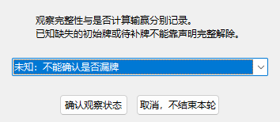
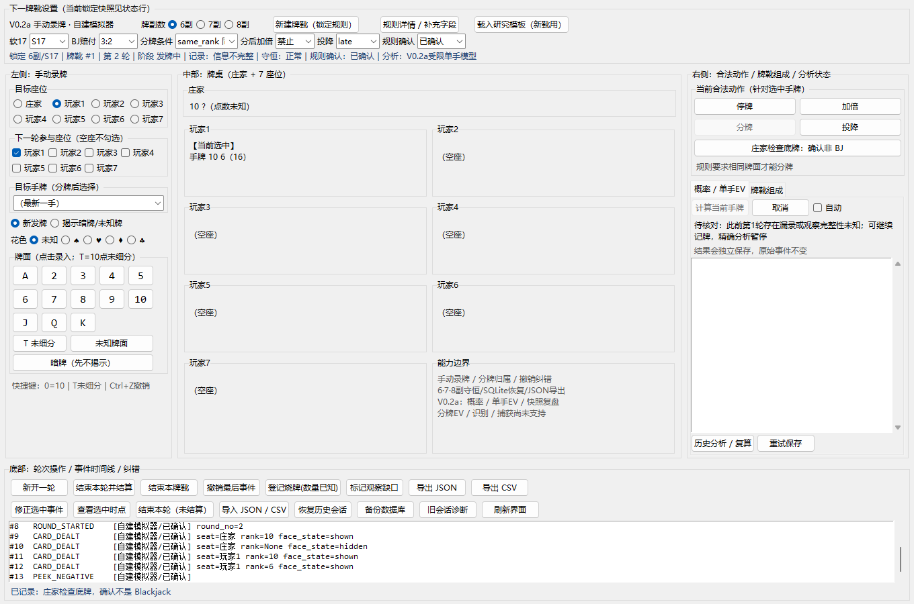
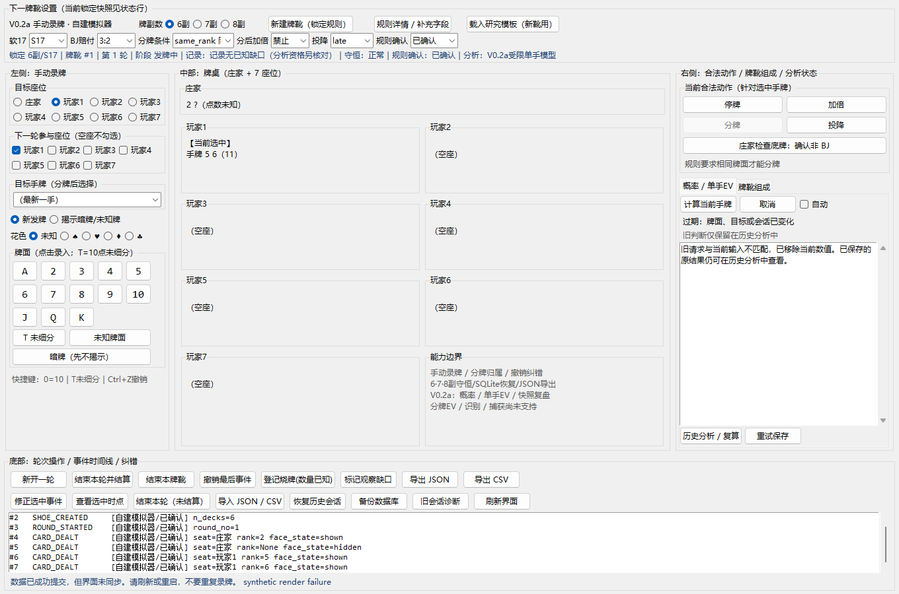

# V0.2a 增量修复验收记录

**后续状态：本文保留 `039900e` 时缺少证据包的历史记录。原包现已提供，48 场景和4项原交接用例已在完整工程通过；当前补充证据见 [合并验收补充](V0.2a合并验收补充.md)。以下原始结果与当时门禁状态不改签。**

2026-09-10；应用版本 `0.2.0a2`。R1／R2／R3 已修复并在 Windows 完整工程实跑。**本机已提供材料的验收通过；原审查证据 ZIP 未提供，48 个原补充场景和原交接测试文件尚不能执行／逐项核对，因此不能据此宣告全部合并门禁完成。**

对应 [增量审查原文](reviews/Hakimi_Blackjack_V02a_增量审查与下一单_20260910.md)。原文是提供给本任务的审查材料，不是已经在 GitHub 提交或批准的正式 Review。

## 已交付行为

| 问题 | 修复结果 | 直接证据 |
|---|---|---|
| R1 跨轮漏录失忆 | 结束事件分别记录结算与三态观察完整性，默认未知；派生状态保留结束事件和缺牌代码。已知缺牌不能靠声明完整覆盖；同靴后续分析持续停用 | `test_round_observation` 的漏初始牌、待补／加倍／分牌／庄家待补、旧缺字段、撤销、追加纠错、历史前缀、JSON/CSV、SQLite 恢复用例 |
| R1 正向对照 | 明确完整但暂不结算可保留分析资格；全部玩家爆牌时不强迫庄家继续补牌 | 精确输入构建测试及真实观察状态选择框、下一轮计算按钮和结果 |
| R2 提交后重绘失败 | SQLite 提交与内存发布后同步使当前旧判断失效；刷新方法是否成功不影响撤下数值和终止旧进程 | 已显示／进行中两条故障链，以及 refresh_all／refresh_hands／refresh_table 故障注入；数据库只增加一次且提示已保存 |
| R2 发布前第二道检查 | 发布前读取真实控制器版本及当前目标，校验请求 ID／输入摘要；通知丢失且两个旧缓存相等也不能发布 | `test_publish_guard_reads_real_token_when_notifications_are_missing`；目标、同会话恢复、导入以及写库失败正向对照 |
| R2 历史复算 | 明确绑定原快照和输入，当前录牌／换目标不误伤历史请求；原快照不覆盖 | 真实进程复算后断言原摘要、历史标签、不同新 ID、原文件字节一致；既有重启复算控件测试继续通过 |
| R3 取消自动回调 | 取消／关闭自动撤销排队回调；取消后同一输入不会由下次轮询重新启动；新输入或显式计算可以启动 | 实际取消／自动复选框、250ms 窗口、失败刷新后取消、下一次录入和手动计算 |

完整字段兼容和生命周期定义见 [观察与生命周期契约](V0.2a观察与生命周期契约.md)。不更换 GUI、网络服务、数据库结构或概率算法。新增 app 版本用于区分资格与 UI 生命周期修复；数学引擎及策略版本不变。

## 当前固定源码证据

功能修复提交：`e8f230a`（观察完整性）、`a602222`（生命周期）；另有 `e80ba6e` 修正截图采集时的窗口绘制时机。验收固定提交为 **`e80ba6e99f7f68df3c8a7aa46db9d79f8269094e`**，执行前工作树干净，检查期间运行代码字节不变。后续报告提交只加入材料，不能改签原回执。

原始 [receipt.json](acceptance/acceptance-v02a-20260910-210407-06ee12/receipt.json) 包含命令、退出码、环境和输出哈希；源码清单 SHA256：`293435b00c6116638c8cadb43a552ebf13d2a330cfee14857c7bf3e72f267ca4`。

| 检查 | 本机实际结果 |
|---|---|
| 完整 unittest | 177 项通过：原 154 项继续执行，加 23 项新回归；无跳过／expectedFailure |
| 断网工作流 | 其中 46 项重叠复测通过，含新 R1/R2/R3；socket 连接／解析拦截覆盖独立进程及分析子进程，0 次网络尝试。不是操作系统防火墙测试，不与177相加 |
| 原数学测试 | 原 5 项照常执行通过。生产概率／动作、Fraction 参考和原数学测试四个 Git blob 与审查文件给出的哈希逐一相等 |
| 固定种子模拟 | 6／7／8 副各20,000独立合成轮，停／加倍复用同一组轮，六项比较满足预定6SE辅助阈值；不是缺失的48场景 |
| 自检和编译 | 退出0 |
| 目标机性能 | Windows 11／Python 3.14.6；18个冷请求 P50 0.260655秒，P95／最大1.101654秒；最大分析子进程峰值工作集157.25 MiB；场景与2秒P95／5秒预算不变 |
| 实际界面 | 既有1360×900／1180×800正常／部分比较；新增观察选择、跨轮阻断、提交后刷新异常、自动取消窗口截图及控件断言 |

模拟仍保留原固定种子的随机偏差：6副停牌均值 -0.5531，95%区间未覆盖精确值 -0.5409544390，但在预定6SE范围内；未更换种子或把模拟说成精确证明。每项完整值见 [analysis-validation.json](acceptance/acceptance-v02a-20260910-210407-06ee12/math-performance/analysis-validation.json)。

## 首次失败、契约调整与未完成门禁

首次本机新编的四条最小复现全部失败，原输出和可核对原源码保存在 [review-fixes-20260910-204645-169c6f](acceptance/review-fixes-20260910-204645-169c6f/before-receipt.json)。它们依据审查正文的触发序列编写，**不是尚未取得的证据包内交接文件**。原源码按执行前 SHA256 校验后保留，未把后续增加的用例改签为首次复现。

这些最小断言分别是：跨轮漏录不得构建精确输入；旧结果已显示时提交一次但重绘失败仍须清空；旧请求进行中时同类提交必须取消且不得保存晚返回结果；取消后等待原 debounce 窗口不得调用计算服务。已扩充为正式 regression 文件中的12项，与另外11项观察完整性测试共同执行。

原完整会话夹具的3处结束操作增加显式 complete；两个原 Tk 未结算场景增加 unknown 选择。原物理剩余、收益、存储和快照断言保留。首次全量回归出现的1项物理剩余断言失败，以及新测试把元组误写成列表产生的2项断言失败，均保留原输出，未删除测试或加 expectedFailure。

首次新增截图脚本在主窗口尚未完整绘制时截图，出现部分控件空白；该图与当时回执保存在 `acceptance-v02a-20260910-210128-d048cf`。随后只修正截图流程，等待真实 Tk 窗口绘制后再次验收，上方引用新的独立输出。

合并前仍须取得 **`Hakimi_Blackjack_V02a_增量审查证据包_20260910.zip`**，执行其原48补充场景并逐项确认4项交接用例与正式断言等价。仅有 Markdown 中的外部运行结论及相同源码哈希，不替代此次执行证据。GitHub Actions 的新 HEAD 状态另以 PR 的实际运行记录核对，不沿用 ee485dd 的成功记录。材料未齐前保留 PR，不合并 main，也不标记完整目标结束。

V0.2b 继续作为下一阶段：先冻结单玩家分牌的再分、分A、DAS、原注／追加注口径，所有手共享剩余牌靴和庄家条件信息；不得把单手分布独立相乘。之后再明确多玩家出牌顺序和其他玩家行为假设。此次修复没有扩张到分牌 EV、识别或捕获。
